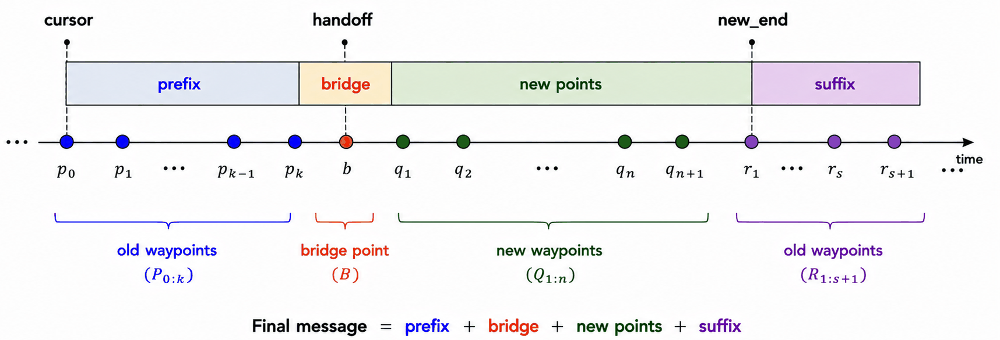

.. _gsoc2026_physical_ai:

GSoC 2026: Physical AI Inference and Trajectory Upscaling
==========================================================

Learned manipulation policies (VLAs, diffusion policies, ACT) emit joint targets at roughly 20 to
50 Hz and replan every 50 to 500 ms, while the hardware underneath expects a fresh command on every
control cycle at 500 Hz to 2 kHz. Forwarding those sparse waypoints as they arrive puts a velocity
discontinuity and an acceleration spike at every waypoint.

This Google Summer of Code 2026 project closed that gap in ``ros2_controllers``: the
``joint_trajectory_controller`` (JTC) can now merge an incoming trajectory into the one it is
already executing, reconstruct missing derivatives from positions-only chunks, and a new
``cartesian_trajectory_controller`` accepts end-effector pose chunks.

Trajectory replacement with blending
-------------------------------------

When a new trajectory arrives mid-execution, JTC previously discarded the active one. A
future-stamped message killed the running trajectory the moment it arrived and ramped slowly to its
first point, and joints the message omitted froze in place.

The controller now assembles a single merged trajectory at the moment the message arrives, built
from four pieces:

   The merged message. Prefix, bridge and suffix all come from the old trajectory; only the new
   points are the client's message.

* **Cursor** is where the robot actually is on the old trajectory. It is the playback position
  rather than wall-clock time, so the merge stays correct when speed scaling is active.
* **Prefix** holds the old waypoints between the cursor and the handoff instant. The robot therefore
  continues along the path it was already following, preserving any obstacle avoidance planned into
  it, instead of cutting straight towards the new trajectory.
* **Bridge** is a single point sampled analytically from the old trajectory's spline at the handoff.
  Because it comes from the spline rather than from the measured hardware state, the seam carries a
  real velocity and acceleration instead of zeros.
* **New points** are the client's message, re-timed onto the merged timeline.
* **Suffix** holds old waypoints beyond the end of the new message. Joints that the new message did
  not mention keep following their original motion and finish it, rather than freezing at their
  current position.

Enabled by ``allow_trajectory_replacement`` (default ``true``); set it to ``false`` for the previous
hard-replace behaviour. See the documentation of :ref:`joint_trajectory_controller_userdoc` for the full parameter description.

Positions-only action chunks
-----------------------------

JTC selects its interpolation degree from the fields present in the message, so a positions-only
chunk falls back to linear interpolation: a staircase velocity and an impulse acceleration at every
knot. With ``positions_upsampling`` enabled, the controller instead:

* solves the knot velocities that a global cubic spline would have, one tridiagonal system per joint
  in O(n), in the non-real-time subscription callback;
* writes those velocities into the message, so the existing cubic Hermite sampling reproduces a C2
  trajectory;
* synthesizes ``time_from_start`` from a policy frequency when the chunk arrives without timing.

Nothing in the real-time path changes, and messages that already carry velocities pass through
untouched, so the feature is a strict superset of the previous behaviour.

.. list-table::
    :widths: 45 55
    :align: center

    * - .. figure:: images/gsoc2026_upsampling.png

           One chunk, with and without upsampling.

      - .. figure:: images/gsoc2026_cross_chunk_continuity.png

           A stream of chunks, with and without cross-chunk continuity.

Streaming chunks additionally need continuity across the seam between them. Rest boundary conditions
at both ends of every chunk plan a stop at each seam; clamping the start of each chunk to the last
commanded velocity removes it, while the chunk still ends at rest so that a policy which stops
publishing leaves the robot stationary.

.. list-table::
    :widths: 50 50
    :align: center

    * - .. figure:: images/gsoc2026_pick_and_place.gif

           A pick-and-place policy running at 5 Hz.

      - .. figure:: images/gsoc2026_pick_and_place_jerk.png

           Jerk on the same motion; peaks drop by roughly a factor of four.

Cartesian trajectory controller
--------------------------------

Interpolating in joint space between two configurations does not move the tool along a straight
line, and several policy families emit end-effector poses rather than joint angles. The
``cartesian_trajectory_controller`` subclasses JTC and accepts
``trajectory_msgs/MultiDOFJointTrajectory`` on ``~/cartesian_reference``. Per message it:

* interpolates the path in Cartesian space, cubic Hermite for translation and SLERP for rotation, so
  the rotation follows the shortest geodesic;
* resamples that path densely and runs differential inverse kinematics through
  ``kinematics_interface`` at every sample;
* hands the resulting ordinary joint trajectory to the base class for execution.

All of the kinematics runs once per message in the non-real-time callback, so the real-time loop
stays as fast as plain JTC.

.. list-table::
    :widths: 40 60
    :align: center

    * - .. figure:: images/gsoc2026_cartesian_ros_letters.gif

           The tool centre point tracing a path on a 6-DOF arm.

      - .. figure:: images/gsoc2026_cartesian_tracking.png

           Commanded path (green) against the executed tool centre point (blue).

Trying it out
--------------

Both demos run on mock hardware, so they need no robot.

``example_19`` streams positions-only chunks from a mock policy to a 2-DOF RRBot:

.. code-block:: shell

  ros2 launch ros2_control_demo_example_19 bridge_demo.launch.py

  # then, with the policy stopped, check C1/C2 continuity and the chunk seams
  ros2 launch ros2_control_demo_example_19 bridge_demo.launch.py run_policy:=false gui:=false
  ros2 run ros2_control_demo_example_19 verify_smoothness.py

``example_20`` drives a 6-DOF arm through Cartesian patterns:

.. code-block:: shell

  ros2 launch ros2_control_demo_example_20 cartesian_demo.launch.py   # try pattern:=square or line

  # the verifier reports pass/fail for straight-line deviation, orientation
  # SLERP, multi-pose chunks, Cartesian smoothness and joint-limit violations
  ros2 launch ros2_control_demo_example_20 cartesian_demo.launch.py run_policy:=false gui:=false
  ros2 run ros2_control_demo_example_20 verify_cartesian_tracking.py

Further reading
----------------

* `Project work product <https://github.com/vedh1234/gsoc2026-ros2-control>`_, with the full report,
  the design alternatives considered, the current limitations of each feature and links to every
  pull request.
* `Design documents <https://drive.google.com/drive/u/0/folders/1xI1t85kyrz7SPEhrgykc0YREK2ujV5vy>`_
  written during the project, including the spline method comparison and the Cartesian control study.
* `Spinoff ideas <https://docs.google.com/document/d/1pwIeKBbK0psOBsYPCz8ptdvFYKlFri0opK-qlxrDw9I/edit?tab=t.0>`_,
  eight follow-on projects written up with requirements and priorities. They range from factoring the
  trajectory upscaling primitives into ``control_toolbox`` so any controller can reuse them, through
  an IKFast plugin for ``kinematics_interface`` and a ``FollowCartesianTrajectory`` action server,
  to tool-frame relative commands and a comparative study of VLA policies running through this
  stack. Each entry states its requirements and a priority, so they can be picked up directly as
  contributions or as future GSoC projects.

Dissemination
--------------

This work will be presented as part of the ros2_control project update at
`ROSCon Global 2026 <https://roscon.ros.org/2026/>`_ in Toronto, 22 to 24 September.
The talk will cover handling policy inference and jitter inside the control loop.
`ROS Physical AI Special Interest Group <https://physical-ai.ros.org/>`_, the OSRA group working to
identify and remove the friction points that slow Physical AI development in ROS, whose proposals
and code are developed in the open at `ros-physical-ai <https://github.com/ros-physical-ai>`_.
Both demos above currently run on mock hardware; the next step is running the same motions on real arms.

Acknowledgements
-----------------

This project was carried out during Google Summer of Code 2026 with the ros2_control team.
Thanks to Sai Kishor Kothakota, Dr. Bence Magyar and Christoph Fröhlich for the guidance and reviews throughout the project.
Thanks to the ros2_control maintainers and contributors for reviewing the pull requests, and to the Open Source Robotics Foundation for hosting the project.

CC-BY Vedhas Talnikar

Mentors: Dr. Bence Magyar (Locus Robotics), Sai Kishor Kothakota (PAL Robotics)
